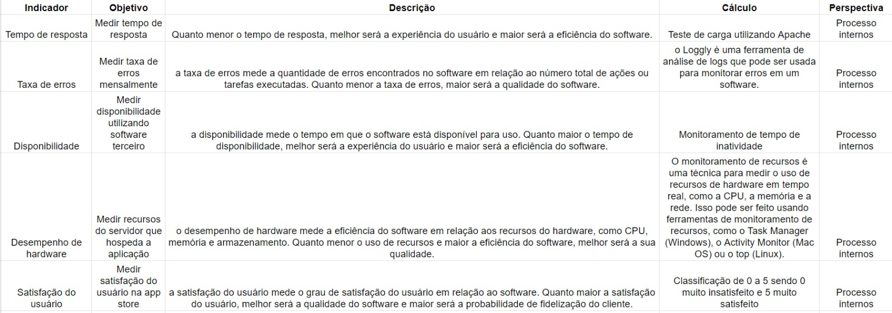
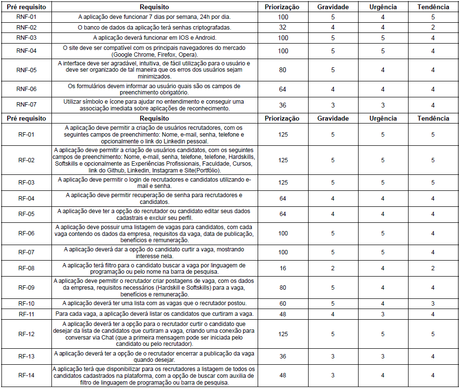
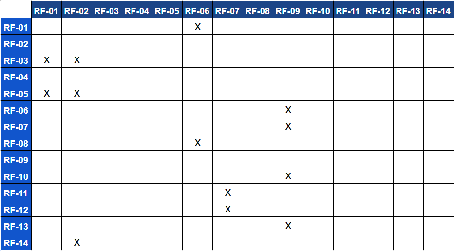

# Especificações do Projeto

Por meio da técnica de observação e brainstorming foram analisadas as necessidades dos usuários do sistema de forma a atender suas demandas.

A partir das informações coletadas, foram determinadas as personas e histórias de usuários que serão de suma importância para a definição das funcionalidades.

## Personas

As personas, ou seja, os usuários ideais do site foram definidos abaixo:

**Isabela:**

- Isabela tem 35 anos, mora em São Paulo e atua como Tech Recruiter em uma empresa de sua região.
- Ela recebeu uma solicitação do setor de RH da empresa para contratar alguns profissionais com perfil voltado para a área de tecnologia.
- Isabela verificou que os candidatos devem possuir algumas habilidades em linguagens de programação específicas.
- Ela então necessita de um meio para divulgar as vagas e assim receber candidaturas para a mesma.
- Isabela precisa verificar quem se interessou na vaga e se o perfil desta pessoa se encaixa na vaga, para possível contato.

**Fernando:**

- Fernando tem 26 anos, atualmente mora em Belo Horizonte, atua como gestor de uma equipe de desenvolvedores em uma empresa de sua região.
- Ele percebe que necessita de mais um desenvolvedor .NET, pois o projeto está escalando e precisará de algumas alterações no sistema.
- Fernando então decide fazer uma busca ativa por candidatos que possuam conhecimento em .NET abertos ao mercado de trabalho.
- Ele após encontrar algum perfil que se enquadra na vaga, precisa entrar em contato com o candidato para apresentar a proposta.

**Felipe:**

- Felipe, mora em Belo Horizonte e possui 19 anos.
- Ele cursa Análise e Desenvolvimento de Sistemas e está em busca de sua primeira oportunidade como desenvolvedor.
- Felipe realizou diversos cursos direcionados para desenvolvimento web Frontend, criou seu portfólio e atuou como freelancer em alguns projetos da área.
- Ele então decide buscar vagas com o tema “Desenvolvedor Frontend”.
- Fernando, após encontrar alguma vaga interessante, tem a necessidade de demonstrar esse interesse para o recrutador, para que o mesmo possa analisar seu perfil.

**Bianca:**

- Bianca possui 23 anos, mora em São Paulo e atua como desenvolvedora Python.
- Ela está buscando uma recolocação na mesma linguagem de programação, porém em uma outra empresa.
- Bianca então deseja visualizar diversas vagas com esse tema, bem como os requisitos e benefícios, para assim tomar verificar se está vaga seria de seu interesse.
- Ela após encontrar uma vaga interessante, gostaria de demonstrar que está aberta a participar do processo de seleção.
- Bianca então, caso o recrutador goste do seu perfil, gostaria de entrar em contato para solucionar algumas dúvidas que restaram sobre a vaga.

## Histórias de Usuários

Com a observação do cotidiano das personas e a compreensão de suas necessidades, foram definidas as seguintes histórias de usuários.

| EU COMO... `PERSONA` | QUERO/PRECISO ... `FUNCIONALIDADE`                                                           | PARA ... `MOTIVO/VALOR`                                                             |
| -------------------- | -------------------------------------------------------------------------------------------- | ----------------------------------------------------------------------------------- |
| Isabela              | Realizar o seu cadastro e login no sistema como uma recrutadora.                             | Poder publicar vagas abertas em sua empresa ou encontrar candidatos de forma ativa. |
| Felipe               | Realizar o seu cadastro no aplicativo como um candidato.                                     | Encontrar vagas relacionadas ao seu perfil e demostrar interesse nas mesmas.        |
| Fernando             | Fazer alterações em seus dados cadastrais.                                                   | Ajustar o seu nível de habilidade em desenvolvimento Frontend.                      |
| Bianca               | Visualizar diversas vagas de trabalho no mercado de tecnologia.                              | Analisar requisitos das vagas, modelo de trabalho e remuneração.                    |
| Bianca               | Deletar seu perfil.                                                                          | Encontrou a vaga que desejava.                                                      |
| Felipe               | Demostrar interesse em uma determinada vaga que se encaixou em seu perfil.                   | Mostrar ao recrutador seu interesse na vaga.                                        |
| Bianca               | Filtrar as vagas que possuam requisitos relacionados a linguagem de programação que utiliza. | Possui preferência por vagas relacionadas a linguagem Python.                       |
| Isabela              | Criar uma postagem de vaga aberta em sua empresa.                                            | Receber candidaturas pra que possa selecionar a pessoa ideal para a vaga.           |
| Fernando             | Buscar candidatos com habilidades em uma linguagem de programação específica.                | Procura alguém especializado em .NET C#.                                            |
| Isabela              | Encerrar uma vaga aberta postada anteriormente na plataforma.                                | Encontrou o candidato que precisava.                                                |
| Fernando             | Entrar em contato com um candidato que se enquadrou no perfil que buscava.                   | Solicitar mais informações ao candidato e marcar uma entrevista.                    |
| Isabela              | Verificar os candidatos interessados na vaga.                                                | Selecionar os melhores perfis.                                                      |
| Felipe               | Recuperar sua senha.                                                                         | Não se lembra da senha anterior.                                                    |
| Isabela              | Visualizar todas as vagas que postou na plataforma.                                          | Controle de vagas abertas e encerradas.                                             |
| Fernando             | Demonstrar interesse em um candidato.                                                        | Demonstrar ao candidato que gostou do seu perfil.                                   |

## Modelagem do Processo de Negócio

Propósito da Modelagem: O propósito da modelagem de processos é representar visualmente os fluxos de atividades, informações e decisões em uma organização, facilitando a compreensão, otimização e documentação dos processos para melhorar a eficiência e eficácia operacional.

### Análise da Situação Atual

A análise da situação atual envolve a avaliação detalhada dos fatores presentes, identificação de problemas e oportunidades, e a base para tomada de decisões informadas, garantindo uma compreensão precisa do cenário atual para orientar ações futuras.

### Descrição Geral da Proposta

Fluxo inicial e geral do processo do negócio que explica como surge o match e como o acontece o contato entre recrutador e candidato.

### Processo 1 – CADASTRO DO CANDIDATO E RECRUTADOR

Processo de cadastro para candidatos e recrutadores em BPMN 2.0

## Indicadores de Desempenho

Na tabela abaixo temos indicadores de desempenho utilizados no projeto:

## Requisitos

No projeto, sua estrutura e suas funções são determinadas a partir dos requisitos funcionais e não-funcionais.

Os requisitos funcionais podem ser definidos como a descrição das funções que os usuários poderão utilizar para satisfazer suas necessidades. Já os requisitos não funcionais são aqueles que descrevem as características de usabilidade e outros aspectos que o site necessita apresentar de maneira geral.

Portanto, com os estudos das personas e histórias dos usuários identificadas para o projeto, foram definidos os seguintes requisitos.

### Requisitos Funcionais

Os requisitos funcionais do projeto e seus respectivos níveis de prioridade de entrega são apresentados na tabela a seguir.

| ID     | Descrição do Requisito                                                                                                                                                                                                                                                                         | Prioridade |
| ------ | ---------------------------------------------------------------------------------------------------------------------------------------------------------------------------------------------------------------------------------------------------------------------------------------------- | ---------- |
| RF-001 | A aplicação deve permitir a criação de usuários recrutadores, com os seguintes campos de preenchimento: Nome, e-mail, senha, telefone e opcionalmente o link do LinkedIn pessoal.                                                                                                              | ALTA       |
| RF-002 | A aplicação deve permitir a criação de usuários candidatos, com os seguintes campos de preenchimento: Nome, e-mail, senha, telefone, telefone, Hardskills, Softskills e opcionalmente as Experiências Profissionais, Faculdade, Cursos, link do GitHub, LinkedIn, Instagram e Site(Portfólio). | ALTO       |
| RF-003 | A aplicação deve permitir o login de recrutadores e candidatos utilizando e-mail e senha.                                                                                                                                                                                                      | ALTO       |
| RF-004 | A aplicação deve permitir recuperação de senha para recrutadores e candidatos.                                                                                                                                                                                                                 | MÉDIA      |
| RF-005 | A aplicação deve ter a opção do recrutador ou candidato editar seus dados cadastrais e excluir seu perfil.                                                                                                                                                                                     | MÉDIA      |
| RF-006 | A aplicação deve possuir uma listagem de vagas para candidatos, com cada vaga contendo os dados da empresa, requisitos da vaga, data de publicação, benefícios e remuneração.                                                                                                                  | ALTO       |
| RF-007 | A aplicação deverá dar a opção do candidato curtir a vaga, mostrando interesse nela.                                                                                                                                                                                                           | ALTO       |
| RF-008 | A aplicação terá filtro para o candidato buscar a vaga por linguagem de programação ou pelo nome na barra de pesquisa.                                                                                                                                                                         | BAIXA      |
| RF-009 | A aplicação deve permitir o recrutador criar postagens de vaga, com os dados da empresa, requisitos necessários (Hardskill e Softskills) para a vaga, benefícios e remuneração.                                                                                                                | ALTO       |
| RF-010 | A aplicação deverá ter uma lista com as vagas que o recrutador postou.                                                                                                                                                                                                                         | ALTO       |
| RF-011 | Para cada vaga, a aplicação deverá listar os candidatos que curtiram a vaga.                                                                                                                                                                                                                   | ALTO       |
| RF-012 | A aplicação deverá ter a opção para o recrutador curtir o candidato que desejar da lista de candidatos que curtiram a vaga, criando uma conexão para conversar via Chat (que a primeira mensagem pode ser iniciada pelo candidato ou pelo recrutador).                                         | ALTO       |
| RF-013 | A aplicação deverá ter a opção de o recrutador encerrar a publicação da vaga quando desejar.                                                                                                                                                                                                   | MÉDIA      |
| RF-014 | A aplicação terá que disponibilizar para os recrutadores a listagem de todos os candidatos cadastrados na plataforma, com a opção de buscar com auxilia de filtro de linguagem de programação ou barra de pesquisa.                                                                            | MÉDIA      |

### Requisitos não Funcionais

Os requisitos não funcionais que a equipe deverá seguir durante o desenvolvimento, como também seus respectivos níveis de prioridade de entrega são apresentados na tabela a seguir.

| ID      | Descrição do Requisito                                                                                                                                          | Prioridade |
| ------- | --------------------------------------------------------------------------------------------------------------------------------------------------------------- | ---------- |
| RNF-001 | A aplicação deve funcionar 7 dias por semana, 24h por dia.                                                                                                      | ALTA       |
| RNF-002 | O banco de dados da aplicação terá senhas criptografadas.                                                                                                       | MÉDIA      |
| RNF-003 | A aplicação deverá funcionar em IOS e Android.                                                                                                                  | ALTA       |
| RNF-005 | O site deve ser compatível com os principais navegadores do mercado (Google Chrome, Firefox, Opera).                                                            | ALTA       |
| RNF-006 | A interface deve ser agradável, intuitiva, de fácil utilização para o usuário e deve ser organizado de tal maneira que os erros dos usuários sejam minimizados. | MÉDIA      |
| RNF-007 | Os formulários devem informar ao usuário quais são os campos de preenchimento obrigatório.                                                                      | MÉDIA      |
| RNF-008 | Utilizar símbolo e ícone para ajudar no entendimento e conseguir uma associação imediata sobre aplicações de reconhecimento.                                    | MÉDIA      |

## Restrições

A tabela a seguir apresenta as condições que limitam a execução desse projeto.

| ID    | Restrição                                                                                                                                                                                                 |
| ----- | --------------------------------------------------------------------------------------------------------------------------------------------------------------------------------------------------------- |
| RE-01 | O projeto deve ser entregue até dia 10/12/2023.                                                                                                                                                           |
| RE-02 | A equipe não pode contratar terceiros para o desenvolvimento do projeto.                                                                                                                                  |
| RE-03 | O site deve ser desenvolvido utilizando linguagens de programação para banco de dados relacional e não relacional (SQL e NoSQL)                                                                           |
| RE-04 | O site deve ser desenvolvido utilizando linguagens de programação Back-end, mais especificamente TypeScript juntamente com o framework Nest.js e os frameworks Express e Prisma para a construção da API. |
| RE-05 | site deve ser desenvolvido utilizando linguagens de programação Web, mais especificamente CSS, HTML, TypeScript e bem como o framework NextJS (Base React) e Chakra UI.                                   |
| RE-06 | O site deve ser desenvolvido utilizando linguagens de programação Mobile, mais especificamente CSS, TypeScript e bem como o framework React Native.                                                       |

## Técnica de Priorização de Requisitos

Ao usar a matriz GUT na tecnologia, é possível avaliar fatores como a complexidade do projeto, a qualidade do código, a experiência da equipe de desenvolvimento e a disponibilidade de recursos. Cada um desses fatores pode ser avaliado de acordo com sua importância relativa para o sucesso do projeto, permitindo que a equipe de gerenciamento de projetos priorize os recursos e o tempo de acordo com as necessidades do projeto.

## Diagrama de Casos de Uso

Os diagramas são utilizados na documentação e modelagem dos sistemas e de suas funcionalidades, de modo geral, podemos dizer que são essenciais para a construção de um software coeso.

Em linhas gerais, o diagrama de casos de uso documenta o que o sistema deve fazer do ponto de vista de quem o utiliza, dessa forma, ele apresenta as principais funcionalidades do sistema e a interação dessas com os usuários.

O diagrama a seguir diz respeito ao projeto em questão:

# Matriz de Rastreabilidade

Para identificarmos a correlação entre os requisitos utilizamos a método a Matrix de Rastreabilidade entre Funcionalidades, representada no quadro abaixo:

# Gerenciamento de Projeto

De acordo com o PMBoK v6 as dez áreas que constituem os pilares para gerenciar projetos, e que caracterizam a multidisciplinaridade envolvida, são: Integração, Escopo, Cronograma (Tempo), Custos, Qualidade, Recursos, Comunicações, Riscos, Aquisições, Partes Interessadas. Para desenvolver projetos um profissional deve se preocupar em gerenciar todas essas dez áreas. Elas se complementam e se relacionam, de tal forma que não se deve apenas examinar uma área de forma estanque. É preciso considerar, por exemplo, que as áreas de Escopo, Cronograma e Custos estão muito relacionadas. Assim, se eu amplio o escopo de um projeto eu posso afetar seu cronograma e seus custos.

## Gerenciamento de Tempo

O gerenciamento do tempo é uma parte fundamental nos projetos pois está relacionado ao prazo de entrega do produto final.

Para uma melhor gestão, foi construído um cronograma com as atividades necessárias para a entrega do projeto, com as estimativas de tempo para sua execução. O cronograma foi construído a partir da ferramenta de gestão da microsoft: MS-Project, que contém o gráfico de Gantt, uma ferramenta interessante para melhor visualização do projeto como um todo.

## Gerenciamento de Equipe

A equipe segue a metodologia Agile Scrum como abordagem principal para gerenciar projetos. Para monitorar o andamento do processo, o time faz uso do Kanban, que está disponível na seção "Projects" no repositório do GitHub Classroom. O Kanban é organizado em colunas específicas, incluindo as seguintes:

## Gestão de Orçamento

Para determinar o orçamento de um projeto, é importante considerar não apenas os resultados dos processos anteriores de gerenciamento de custos, mas também as informações e elementos adicionais disponíveis. Com base nas informações fornecidas e nas escolhas feitas, é possível elaborar uma descrição do que será contratado para atender de maneira eficaz às necessidades e objetivos do projeto.

Os valores dessa proposta serão faturados em 5 parcelas sendo uma entrada, três pagamentos intermediários e outro no término após o Diagnóstico, entrega da solução e apresentação, conforme tabela abaixo. Após o aceite formal desta proposta, a parcela será faturada após o aceito formal do cliente da entrega da etapa.
