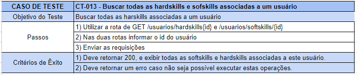
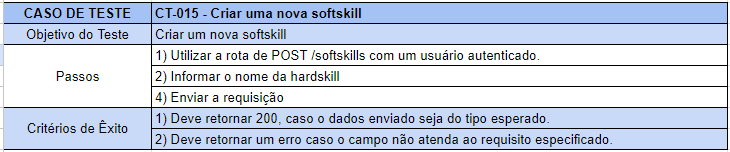

# Plano de Testes de Software

Para realizar os testes das rotas implementadas durante o desenvolvimento do projeto foi elaborado o seguinte plano de testes.

## Plano de teste rotas usuário:

## Plano de teste rotas vagas:

## Plano de teste rotas hardskills:

## Plano de teste rotas softskills:

